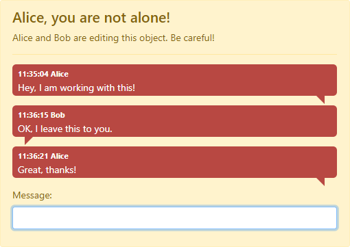

# Multiple Editors Warner Sample

This is a simple sample project that shows how to show a warning when
several users are editing the same object on a web site. It is built
on .NET Core 3.1, Blazor and SignalR. It should be trivial to get this
working on newer version of .NET Core.

Users will see a warning and are able to chat with each other:



## How to use it

When then core part of the code is added to your application, you only need to
add one Blazor component on the pages. On a Razor page it could look like this:

```HTML+Razor
<component type="typeof(Components.MultipleEditorsWarnerComponent)"
           render-mode="Server"
           param-GroupName='@("Color_" + Model.Color.ColorID)'
           />
```

Or, if you are using Blazor:

```HTML+Razor
<MultipleEditorsWarnerComponent GroupName='@("Color_" + Model.Color.ColorID)' />
```

`GroupName` is just a string that uniquely defines the object they are edited.

## About the code

The essential part of this code is found in the **Hubs** folder. First, there is
`MultipleEditorsWarnerHub` that is the SignalR hub for this component. This is
taking care of all messages that are sent. This object is also using a
`UserGroupManager`. That object known which users that are working with which
object. It also keeps track of all chat messages that has been sent.

Note that `UserGroupManager` is just a static object so all data is stored in
memory. This is fine if only one server is used. If the service needs to run on
multiple servers a shared storage, like a database, needs to be used.

Lastly, in the **Components** folder there is the Blazor component
`MultipleEditorsWarnerComponent`. This component is responsible for the UI and
is connecting to the `MultipleEditorsWarnerHub`.

You will notice that the application will warn if the same user is editing the
same object with a delay. The reason for this is that when a user is navigating
from an edit page, it could take a while before all the connections have been
closed. At least in production environment. When debugging it seems to be a
slightly different behavior. If there was no delay, and the user navigated back
to the edit page it will get a confusing warning. If this is the right approach
is discussable. Note that there is no delay for other users.

## Blog post

This project was created when doing [this
blog-post](https://devblog.pekspro.com/posts/detect-and-warn-mulitple-editors).